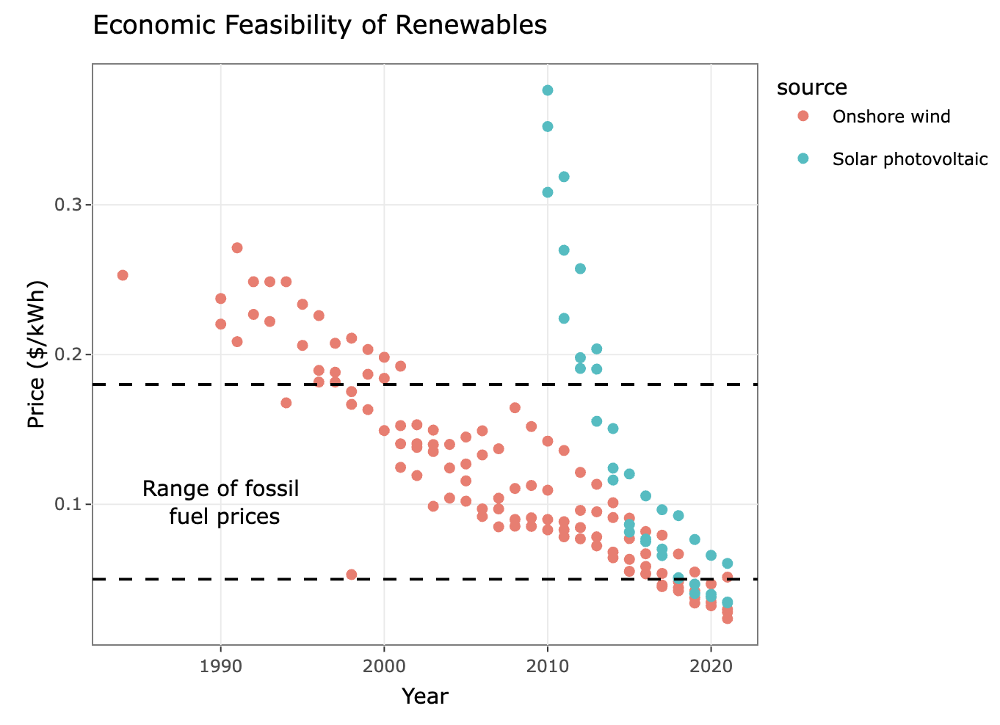

This story focuses on the United Nation's Sustainable Development goal number 13, which covers climate action. The story begins with a background into key statistics that fuel climate change such as population growth and CO2 emissions. Next it gives insight into the current renewable energy snapshot before explaining how energy sources like wind and solar are starting to become market competitive with fossil fuels. How our society rises to meet climate change, will dictate the future of our world. Understanding the data that goes into making climate-related descions is one of the most important ways to be climate-informed steward of the planet.

For the full story, go here: <https://foxredmond.github.io/energy/> (<https://github.com/foxredmond/energy>)
