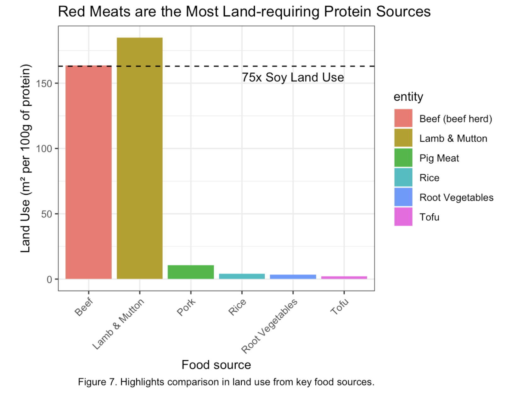

Although large-scale agriculture is a crucial part in today's society, it's contributions to climate change cannot be overlooked. This story takes a look at how land dedicated specifically to grazing and rearing livestock is the biggest culprit in this issue. With a focus on the United Nation's Sustainable Development goal on climate action, we look into the relationship between agricultural land use and climate change. Highlighting India, the story shows how a country that eats proportionally much less red meat, can have lower climate impacts and higher agricultural efficiency. Finally, the reader is led to how alternatives for protein sources like beef and lamb can require up to 75 times less land to produce equal grams of protein.

For the full story, go here: <https://foxredmond.github.io/land_use/> (<https://github.com/foxredmond/land_use>)

