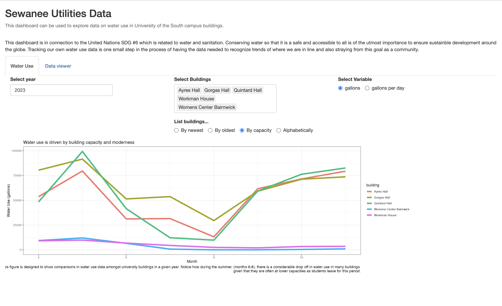

I created this dashboard with Sewanee, Tennessee utility data from the past three years. It is designed with an interface that allows the user to explore different metrics of water use in campus buildings at the University of the South. This is important because tracking water usage data is an important step in order to achieve the UN's goal on sustainable water use. Although people often think of how these goals are lining up the scale of nations and coorperations, it is just as important to track them on the smaller, more local level. With the help of this dashboard, the Sewanee community can become more invested in campus-wide water use.

For a screenshare recording on the full story, go here: <https://drive.google.com/file/d/1LYoCE5x_6DLsj0xF35BLvMjjqLBNg7xA/view?usp=sharing> (<https://github.com/foxredmond/Data_story_4>)

