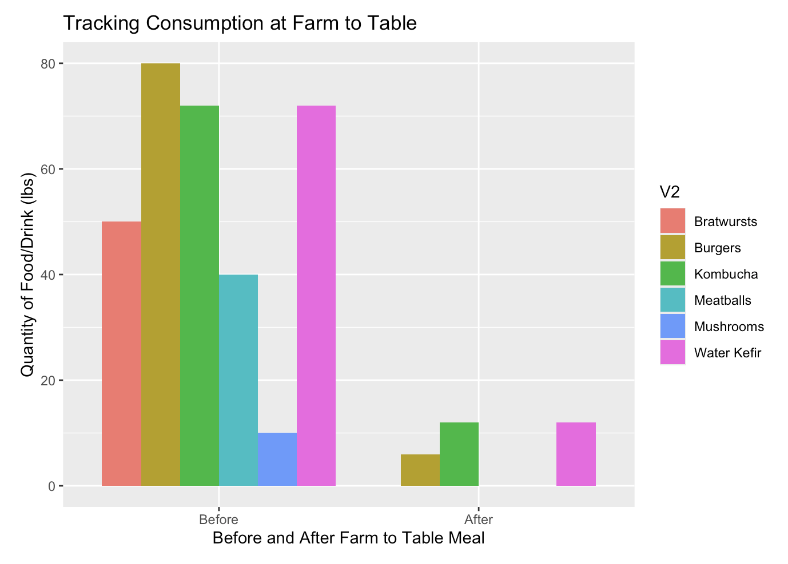

This story begins with my involvement in an event known as Farm to Table, put on at the University of the South in April of 2026. The goal of this student-run event is to have a celebration that introduces the community to the sustainable nature of local food. A priority for this year's Farm to Table was to not have any food waste, which was the the inspiration behind this data. I set up this pipeline to track quantities of food/drink purchased vs actually consumed at the event, so that this data can be referenced in future years to avoid any further waste.

For the data exploration go here: <https://foxredmond.github.io/data_story_5.0/>

For a screenshare recording on the full story pipeline, go here: <https://drive.google.com/file/d/1zCSH3tROwDHGZkpTYrRrBXmefpRnudJk/view?usp=sharing> (<https://github.com/foxredmond/data_story_5.0>)

